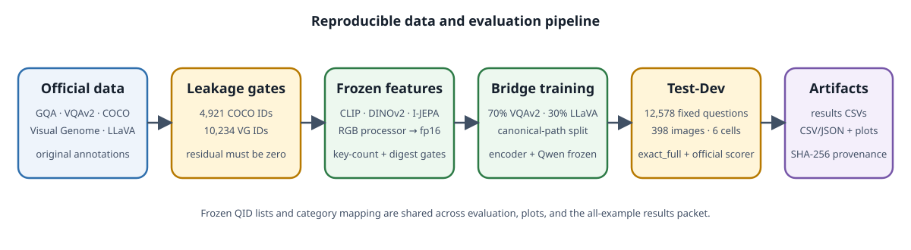

# Data preprocessing and Test-Dev processing



## 1. Acquire upstream data

Download GQA, VQAv2, COCO, Visual Genome, and LLaVA-Instruct-150K from the
official links in [DATA.md](DATA.md). The project does not rename questions or
rewrite annotations. Configuration paths are repository-relative.

## 2. Enforce train/evaluation separation

The included 4,921-ID COCO exclusion is applied when loading both VQAv2 and
LLaVA. Before any Visual Genome-trained graph generator is used, verify the
included 10,234-ID exclusion and audit the generator's actual training IDs:

```bash
python scripts/13_vg_leakage_audit.py
python scripts/13_vg_leakage_audit.py --train-ids path/to/generator_train_image_ids.json
```

The second command must report zero residual evaluation images.

## 3. Freeze evaluation surfaces

Test-Dev is not sampled. `scripts/70_build_testdev_slice.py` sorts and records the
complete published balanced Test-Dev split, verifies all images, proves question-
and image-disjointness from validation-derived surfaces, and records hashes and
category counts. The committed QID list is immutable.

## 4. Assign reasoning categories

`src.data.gqa.category_of()` applies one ordered mapping to every surface:

| Priority | Rule | Category |
|---:|---|---|
| 1 | detailed type starts with `count`, or question starts with “how many” | `count` |
| 2 | structural type is `choose` | `choose` |
| 3 | structural type is `compare` | `compare` |
| 4 | detailed type starts with `exist` | `exist` |
| 5 | semantic type is `rel` | `relate` |
| 6 | otherwise | `other` |

The all-example results packet and both Test-Dev category plots are derived from this
same function. They do not maintain a second category implementation.

## 5. Cache frozen visual features

Images are decoded as RGB and processed by the selected Hugging Face image
processor. Frozen encoder outputs are saved as fp16 tensors under
`outputs/features/`. Cache keys are image filename stems, and exact expected-key
count/digest gates are available in `scripts/06a_cache_features.py`.

```bash
python scripts/06a_cache_features.py \
  --encoder clip \
  --source mixed \
  --limit 150000 \
  --short-frac 0.7
```

## 6. Build the bridge-training mixture

The default bridge recipe draws 70% VQAv2 short-answer examples and 30%
LLaVA-Instruct examples. The validation split is a deterministic CRC32 partition
over canonical image paths, so alternate filesystem mounts do not change
membership. Only the bridge is optimized; the encoder and Qwen2 remain frozen.

## 7. Evaluate and score Test-Dev

`scripts/07_evaluate.py` produces one raw record per QID. Each record includes
question, gold, raw bridge answer, text-only floor answer, category, stop reason,
and metric flags. `scripts/71_score_testdev_official.py` passes raw predictions to
the vendored official GQA scorer and fails if official accuracy diverges from
`exact_full`.

## 8. Build the six-cell results folder

After all six evaluator record files exist, run:

```bash
python scripts/build_testdev_results.py \
  --questions data/gqa/questions/testdev_balanced_questions.json \
  --qids data/gqa/testdev_12578_qids.json \
  --cell clip_mlp256=outputs/eval/testdev/<clip-mlp-records>.json \
  --cell clip_qformer32=outputs/eval/testdev/<clip-qformer-records>.json \
  --cell dinov2_mlp256=outputs/eval/testdev/<dinov2-mlp-records>.json \
  --cell dinov2_qformer32=outputs/eval/testdev/<dinov2-qformer-records>.json \
  --cell ijepa_mlp256=outputs/eval/testdev/<ijepa-mlp-records>.json \
  --cell ijepa_qformer32=outputs/eval/testdev/<ijepa-qformer-records>.json
```

The builder requires identical QID sets and gold answers across all six cells,
recomputes full-string correctness, strips private image mounts, writes category
counts and per-cell accuracies, generates two plots, and hashes every source. The
committed results packet deliberately omits official question/gold text; QIDs and
image IDs join directly to the locally downloaded official files.
