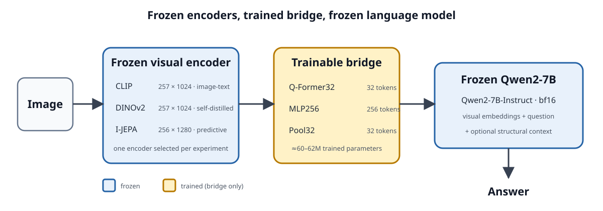
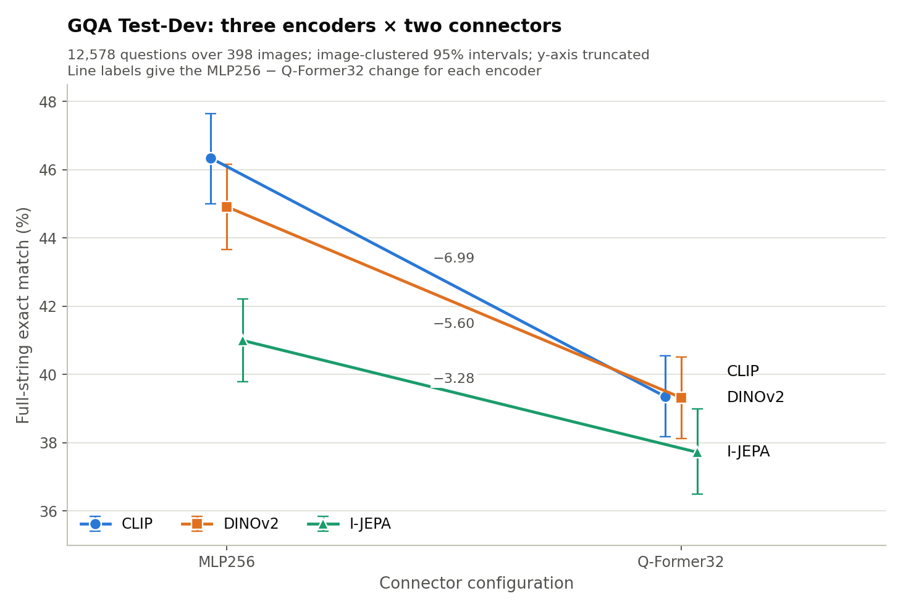
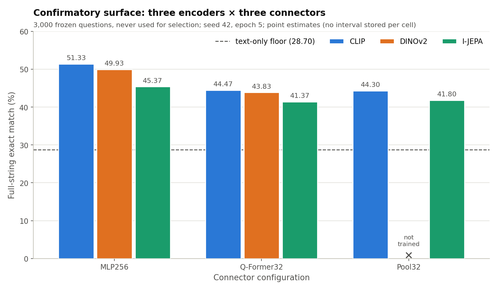
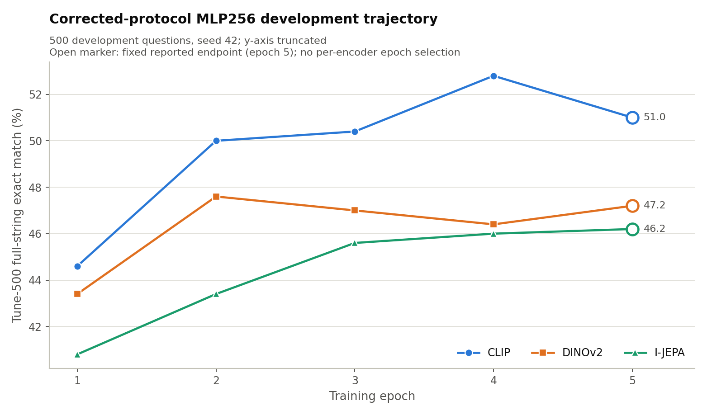
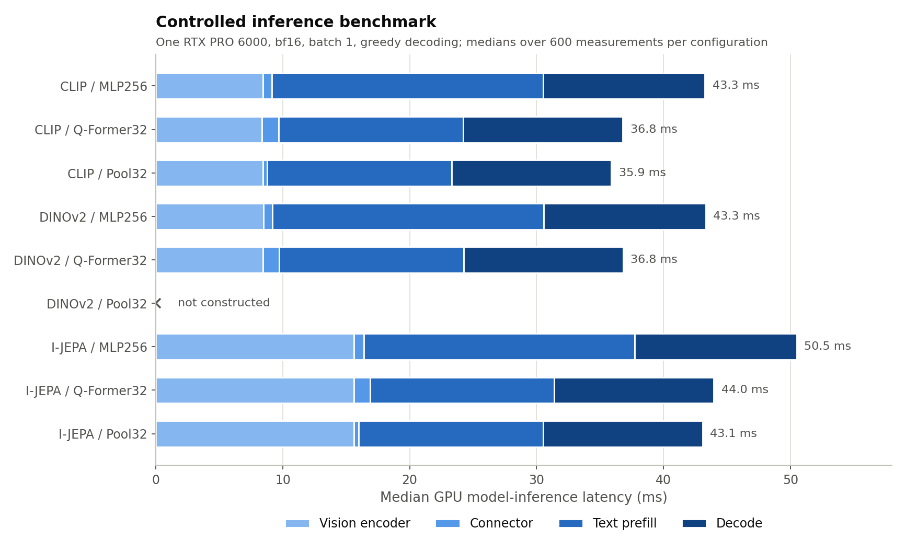
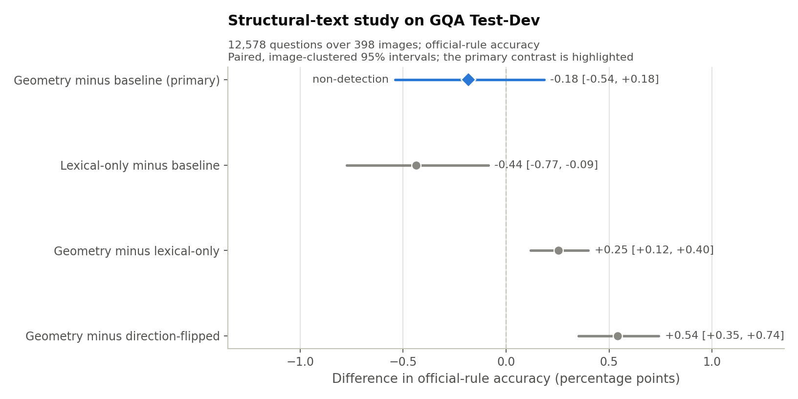
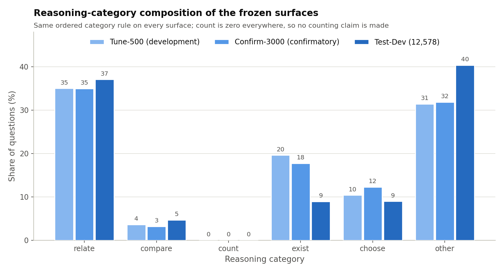
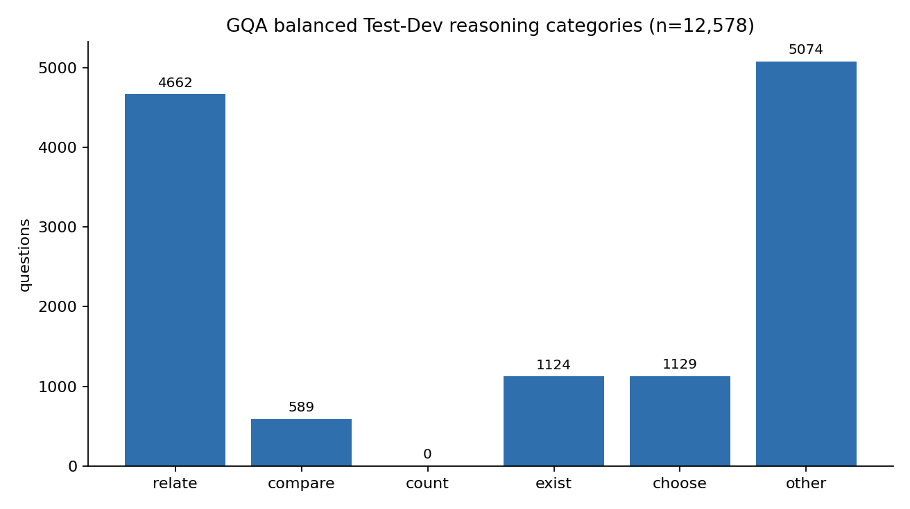
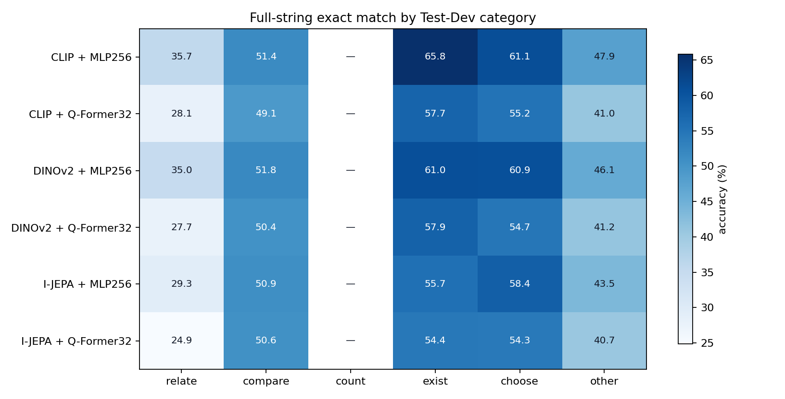
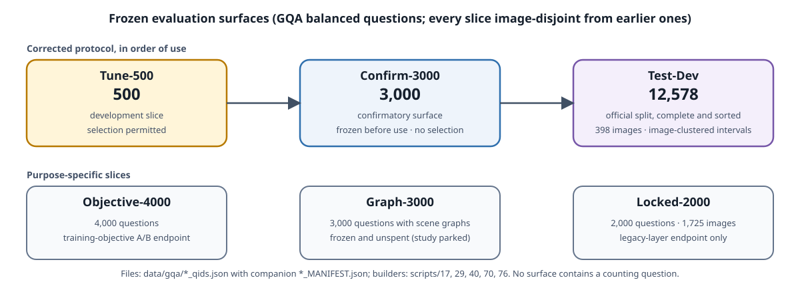

# Frozen-Encoder VLM Reasoning

[](https://github.com/OssamaAzab/vlm-reasoning-reproducibility/actions/workflows/ci.yml)

Reproducibility code for a vision-language model in which a frozen vision
encoder is connected to a frozen Qwen2 language model through a trainable bridge.
The repository covers bridge training, GQA evaluation, inference-time structural
augmentation, and machine-readable result catalogues.

```text
image -> frozen vision encoder -> trainable bridge -> frozen Qwen2-7B-Instruct
                                                        + question -> answer
```

## Project at a glance



The controlled comparison swaps three frozen visual encoders—CLIP, DINOv2, and
I-JEPA—across matched-budget connector families while keeping Qwen2-7B-Instruct
frozen. Only the bridge is trained (about 60–62M parameters in every arm, sized per
encoder so that connector comparisons are not confounded by capacity; exact counts
are in [`artifacts/model_inventory.json`](artifacts/model_inventory.json)).

## Research questions

1. **RQ1 — augmentation.** Does inference-time augmentation improve compositional
   visual question answering, and on which GQA reasoning categories (relate,
   compare, exist, choose, other)? As executed, this covers scene-graph injection
   (oracle, predicted, and an externally trained generator), oracle visual crops,
   and question-targeted structural text.
2. **RQ2 — encoder dependence.** Does the outcome depend on the visual encoder's
   training philosophy? A contrastive encoder with language supervision (CLIP), a
   self-distilled encoder without it (DINOv2), and a latent-prediction image
   world-model (I-JEPA) are compared under identical conditions, through two
   connector families.

### Scope as executed

- Retrieval augmentation and the CLEVR-POC benchmark were placed out of scope
  before the corrected-protocol experiments; no retrieval experiment was run and
  counting is not measured (no evaluation surface contains a `count` question).
- An oracle-to-degraded scene-graph study was designed and its frozen 3,000-question
  slice was built (`data/gqa/graph_3000_qids.json`), but the study was parked
  without execution. The slice is unspent and no result rests on it.
- This release contains the endpoint pipeline, its protocol, and its result
  catalogue. Two studies whose *numbers* are quoted here were run from frozen,
  separately recorded code that is not included: the question-targeted
  structural-text study on Test-Dev (the "structural geometry" rows and figure)
  and the image-clustered bootstrap used for the Test-Dev intervals. Their values
  are reproduced verbatim with source hashes in `docs/figures/data/*.json`. The
  mechanistic probing studies (linear readers on encoder and connector
  representations) are likewise not part of this release.

## Key results

| Result | Full-string exact match / contrast | Evidence |
|---|---:|---|
| CLIP / DINOv2 / I-JEPA with MLP256 | 46.34% / 44.92% / 41.00% | GQA Test-Dev, 12,578 questions |
| MLP256 minus Q-Former32 | +6.99 / +5.60 / +3.28 points | CLIP / DINOv2 / I-JEPA |
| CLIP–I-JEPA connector interaction | −3.71 [−5.06, −2.34] points | image-clustered 95% interval |
| Structural geometry minus baseline | −0.18 [−0.54, +0.18] points | primary non-detection |

Machine-readable cells and intervals are in `results/`; the complete six-cell
Test-Dev packet is in [`results/testdev/`](results/testdev/README.md). Test-Dev
intervals are image-clustered because questions nest within 398 images; see the
bootstrap-unit note in [`results/README.md`](results/README.md).

### Confirmatory surface (3,000 frozen questions, never used for selection)

| Encoder | MLP256 | Q-Former32 | Pool32 | Text-only floor |
|---|---:|---:|---:|---:|
| CLIP | 51.33% | 44.47% | 44.30% | 28.70% |
| DINOv2 | 49.93% | 43.83% | — | 28.70% |
| I-JEPA | 45.37% | 41.37% | 41.80% | 28.70% |

Rows: `results/results_corrected_eos.csv`, `split = confirm_3000_qids`,
`metric = exact_full`, `input_mode = image_only`. Every corrected-protocol run
stops on its own EOS token (`eos_rate = 100`, `cap_rate = 0`).

### Paired Test-Dev encoder contrasts at MLP256 (image-clustered 95% intervals)

| Contrast | Points |
|---|---:|
| CLIP − DINOv2 | +1.42 [+0.47, +2.36] |
| CLIP − I-JEPA | +5.34 [+4.26, +6.37] |
| DINOv2 − I-JEPA | +3.92 [+2.92, +4.93] |

Values and sources: `docs/figures/data/encoder_connector_interaction.json`.

## What the evidence says

**RQ2 (encoder dependence): yes, and the size of the difference depends on the
connector.** On every corrected surface the ordering is CLIP ≥ DINOv2 > I-JEPA.
Under MLP256 the encoder gaps are larger than under Q-Former32, and the CLIP–I-JEPA
interaction is detected (−3.71 [−5.06, −2.34] on Test-Dev). An encoder comparison
is therefore only meaningful once the connector is named. The comparison is between
encoders as released; it is not a causal attribution to a pretraining objective,
because the three encoders differ on more than one axis.

**RQ1 (augmentation): not unconditionally.** On the 500-question development
slice (CLIP + MLP256, point estimates in `results/results_corrected_eos.csv`):

- Injecting the image's own ground-truth scene graph lifts accuracy from 51.34% to
  68.66% (+17.32 points) on the 485-question leakage-clean subset: structure that
  the model can use exists. This is a descriptive ceiling, not an achievable
  production estimate.
- Injecting OWLv2-predicted graphs gives +2.0 to +2.2 points on the 500-question
  slice — but a control that injects a graph predicted for the *wrong image* gives
  the same +2.0, so the gain is not evidence that predicted structure is read
  (development diagnostic; point estimates only).
- Graphs from an externally trained generator (RelTR) are a non-detection against
  the no-graph baseline (−0.41 [−3.30, +2.47]) and against a wrong-image graph of
  the same form (0.00 [−2.27, +2.27]) on the leakage-clean subset
  (`results/results_confidence_intervals.csv`).
- On GQA Test-Dev, question-targeted structural text gives no unconditional gain
  (−0.18 [−0.54, +0.18]); its lexical-only component detectably hurts
  (−0.44 [−0.77, −0.09]), while correct geometry beats both lexical-only
  (+0.25 [+0.12, +0.40]) and direction-flipped geometry (+0.54 [+0.35, +0.74]).
  Sources: `docs/figures/data/structural_augmentation.json`.

**Not established:** any effect on counting; any single component as *the*
bottleneck; any claim from the legacy layer (below); byte-level reproduction on a
different GPU architecture. The full list is in [LIMITATIONS.md](LIMITATIONS.md).

### Three encoders × two connectors



On the final GQA Test-Dev surface, MLP256 outperforms Q-Former32 for all three
encoders. The differing slopes show why encoder comparisons must name the connector
through which features reach the language model. The y-axis is truncated to show
the slopes; error bars are image-clustered 95% intervals.

### Confirmatory surface



The same ordering holds on the 3,000-question confirmatory surface, which was
frozen before use and never used for selection. Every bridge sits far above the
text-only floor; DINOv2 + Pool32 was never trained and is shown as absent, not as
zero.

### Training trajectory



This is a development-surface diagnostic, not an epoch-selection plot. Epoch 5 is
the fixed reported endpoint for every encoder.

### Compute and efficiency



The batch-1 benchmark separates vision, connector, prefill, and decode latency on
one RTX PRO 6000. See [COMPUTE.md](COMPUTE.md) for memory, timing, and scope limits.

### Structural augmentation



The primary geometry-versus-baseline interval crosses zero. Secondary controls help
separate lexical content, geometry, and direction, without turning the primary
non-detection into a positive claim.

### Dataset profile



The two validation-derived surfaces (tune-500, confirm-3000) have closely matched
category composition; Test-Dev carries fewer existence questions and more `other`
questions. No surface contains a counting question, so the project makes no
counting claim. Counts are transcribed from `results/results_per_category.csv` and
the Test-Dev manifest.

### Complete Test-Dev results

The [Test-Dev results folder](results/testdev/README.md) contains all 12,578 QIDs
and all six CLIP/DINOv2/I-JEPA × MLP256/Q-Former32 cells as ordinary CSV/JSON,
plus category summaries, plots, and source hashes. Images, questions, and gold
answers remain in the official GQA download rather than being redistributed.





The complete preprocessing and category-assignment path is documented in
[PREPROCESSING.md](PREPROCESSING.md).

## How the evidence was produced

1. **Data and leakage gates.** Official GQA, VQAv2, COCO, Visual Genome, and
   LLaVA-Instruct downloads ([DATA.md](DATA.md)). GQA evaluation images are Visual
   Genome images and many are COCO images, so two exclusion lists are shipped and
   enforced: 4,921 COCO IDs removed from bridge training and 10,234 VG IDs removed
   from every scene-graph generator (`scripts/13_vg_leakage_audit.py`, required
   residual = 0).
2. **Frozen evaluation surfaces.** Each surface is drawn once, by a seeded script,
   hash-recorded, and never resampled (table below).
3. **Frozen features.** Encoder outputs are cached once per image as fp16
   (`scripts/06a_cache_features.py`); the encoder is never fine-tuned.
4. **Bridge training.** One recipe for every arm: 150,000 examples (70% VQAv2 short
   answers, 30% LLaVA instructions), 5 epochs, flat learning rate 1e-4, weight decay
   0.01, batch 8, seed 42, bf16 frozen LLM, ChatML prompt, supervised EOS
   (`scripts/06c_train_bridge.py`; [REPRODUCIBILITY.md](REPRODUCIBILITY.md)).
5. **Evaluation.** `scripts/07_evaluate.py` writes one record per question with the
   bridge answer, a matched text-only floor answer, stop reason, and metrics. The
   primary metric is `exact_full`, which agrees exactly with the official GQA
   scorer on every corrected cell (`scripts/vendor/PROVENANCE.md`).
6. **Uncertainty.** Paired bootstrap over questions for development surfaces
   (`scripts/12_bootstrap_ci.py`, `scripts/30_corrected_interaction.py`) and
   image-clustered paired bootstrap for Test-Dev, 10,000 resamples.
7. **Augmentation experiments.** Scene-graph injection with oracle, predicted, and
   control graphs (`scripts/09_augment_eval.py`, `14`–`18`, `37`–`38`, `43`–`48`);
   visual-information audit (`50`–`54`); oracle crops and a crop-evidence adapter
   (`56`–`64`); Test-Dev freezing and official scoring (`70`–`71`).

### Evaluation surfaces



| File under `data/gqa/` | Questions | Role | Built by |
|---|---:|---|---|
| `tune_500_qids.json` | 500 | Development slice; selection permitted | `scripts/17_build_tuning_slice.py` |
| `tune_500_reltr_clean_qids.json` | 485 | Development subset provably unseen by RelTR | `scripts/44_reltr_clean_slice.py` |
| `confirm_3000_qids.json` | 3,000 | Confirmatory surface; no selection | `scripts/29_build_confirmatory_slice.py` |
| `objective_4000_qids.json` | 4,000 | Training-objective A/B endpoint | `scripts/40_build_objective_slice.py` |
| `graph_3000_qids.json` | 3,000 | Graph-mechanism slice; frozen, unspent | `scripts/76_build_graph_slice.py` |
| `eval_2000_qids.json` | 2,000 | Legacy-layer locked endpoint | seed-42 draw, legacy layer |
| `testdev_12578_qids.json` | 12,578 | Official GQA Test-Dev, complete and sorted | `scripts/70_build_testdev_slice.py` |

Every surface is image-disjoint from the surfaces drawn before it, and each
companion `*_MANIFEST.json` records the draw, the hashes, and the category mix.

## Evidence layers

Two execution protocols are preserved and must not be pooled:

| Layer | Prompt and stopping | Frozen LLM | Primary reading |
|---|---|---|---|
| `legacy_raw_prompt_no_eos` | Raw prompt; EOS not supervised | 4-bit NF4 | Historical diagnostics |
| `corrected_chatml_v1_eos` | ChatML; EOS supervised | bf16 | `exact_full` |

**Why the protocol was corrected.** In the legacy layer the bridge was never
trained to emit a stop token, so generation ran to the token cap and exact-match
scores were largely a truncation artefact. The corrected layer supervises EOS
(every corrected run stops on its own: `eos_rate = 100`, `cap_rate = 0`), uses the
ChatML prompt the LLM was instruction-tuned on, and keeps the LLM in bf16. All
headline results are corrected-layer; legacy VQA-soft values remain available in
`results/results_legacy.csv` only to document the earlier execution layer.

## What is included

- Reusable Python implementation under `src/`.
- Training, evaluation, augmentation, diagnostic, and analysis entry points under
  `scripts/`.
- Frozen evaluation QID lists and leakage-exclusion manifests under `data/`.
- Curated machine-readable result tables under `results/`.
- Portable single-GPU Slurm templates under `cluster/`.
- Focused unit and release-contract tests under `tests/`.

Datasets, pretrained model weights, trained bridge checkpoints, feature caches,
and generated outputs are not stored in Git. See [DATA.md](DATA.md) and
[MODELS.md](MODELS.md).

## Quick start

Prerequisites: Linux, Python 3.12, and an NVIDIA GPU for model execution.
CPU-only commands such as tests and catalogue inspection do not require a GPU.

```bash
git clone https://github.com/OssamaAzab/vlm-reasoning-reproducibility.git
cd vlm-reasoning-reproducibility

python3.12 -m venv .venv
source env.sh
python -m pip install --upgrade pip
python -m pip install -r requirements/ci.txt

python -m pytest -q
python scripts/06c_train_bridge.py --help
python scripts/07_evaluate.py --help
```

Use `requirements/corrected-cu130.txt` for full bf16 Blackwell reproduction, or
`requirements/legacy-cu124.txt` for the historical quantized environment. The
dependency files are intentionally separate measured stacks.

## Reproduction tiers

### Two-minute inspection

Read the key-results table and figures, then inspect
[`results/testdev/predictions.csv`](results/testdev/predictions.csv) and
[`results/testdev/category_summary.csv`](results/testdev/category_summary.csv).
No Python environment, dataset, model, or GPU is required.

### Ten-minute CPU verification

Create the Python 3.12 environment using `requirements/ci.txt`, run
`python -m pytest -q -p no:cacheprovider`, and verify
`release/RELEASE_MANIFEST.sha256`. This checks code and artifact contracts but
does not reproduce GPU scores.

### Full GPU reproduction

Follow [DATA.md](DATA.md), [PREPROCESSING.md](PREPROCESSING.md), and
[REPRODUCIBILITY.md](REPRODUCIBILITY.md). Download upstream data/models, build
feature caches, train new bridge stems, and evaluate the frozen endpoints. See
[COMPUTE.md](COMPUTE.md) before allocating storage or GPU time.

## Core workflow

1. Download the upstream datasets and arrange them as shown in
   [DATA.md](DATA.md).
2. Source `env.sh`; it keeps caches and the virtual environment inside the clone.
3. Verify the included leakage exclusion, then audit the actual generator training IDs:

   ```bash
   python scripts/13_vg_leakage_audit.py
   python scripts/13_vg_leakage_audit.py --train-ids path/to/generator_train_image_ids.json
   ```

   Continue only when the second command reports `residual GQA-eval images = 0`.
4. Cache frozen vision features:

   ```bash
   python scripts/06a_cache_features.py --encoder clip --limit 150000
   ```
5. Train a corrected-protocol MLP bridge:

   ```bash
   python scripts/06c_train_bridge.py \
     --encoder clip \
     --bridge-type mlp \
     --mlp-hidden 5888 \
     --strip-cls \
     --limit 150000 \
     --epochs 5 \
     --llm-precision bf16 \
     --prompt-format chatml_v1 \
     --supervise-eos \
     --ckpt-tag reproduction_clip_mlp_s42
   ```
6. Evaluate a checkpoint on a frozen endpoint:

   ```bash
   python scripts/07_evaluate.py \
     --qids data/gqa/confirm_3000_qids.json \
     --checkpoint outputs/checkpoints/bridge_clip_reproduction_clip_mlp_s42_ep5.pt \
     --num-examples 0
   ```

The checkpoint records its prompt format, stop-token protocol, bridge geometry,
encoder, precision, seed, and training parameters. The evaluator reads those
values and refuses incompatible overrides unless an explicit off-distribution
suffix is supplied.

## Script map

Scripts are numbered in the order the project was built; gaps are steps whose
artifacts are site-specific or superseded and were deliberately left out.

| Scripts | Stage |
|---|---|
| `00`–`05` | Environment check, data inspection and plots, one-image encoding, LLM generation, text-only floor |
| `06`, `06a`–`06c` | Bridge skeleton, feature caching, single-example overfit, bridge training |
| `07`, `09` | Evaluation on a frozen surface; inference-time augmentation evaluation |
| `10`–`12`, `21`–`22`, `26`–`28`, `30`, `32`–`35` | Result collection, epoch curves, bootstrap intervals, seed aggregation, metric sensitivity, paired analysis, corrected interaction, floor identity, loss decomposition |
| `13`–`18` | Visual Genome leakage gate, predicted-graph demo, OWLv2 vocabulary, predicted-graph caches, tuning slice |
| `17`, `29`, `40`, `70`, `76` | Frozen evaluation-surface builders |
| `24`–`25` | Read-only training-mix diagnostics |
| `37`–`38` | Graph-variant caches and the graph-trust analysis |
| `41`–`42` | Training-objective A/B preflight and analysis |
| `43`–`48` | External generator (RelTR): overlap audit, clean slice, graph generation, conditions, analysis, preflight |
| `50`–`54` | Visual-information audit: coverage, evaluation, representation probes, analysis |
| `56`–`58`, `61`–`64` | Oracle crops (Stage A) and the crop-evidence adapter (Stage B) |
| `71` | Official GQA scorer wrapper (scorer downloaded separately) |
| `build_testdev_results.py`, `materialize_testdev_examples.py`, `generate_portfolio_plots.py`, `show_examples.py` | Public Test-Dev packet, local example join, figure regeneration, qualitative examples |

Each script's docstring states its inputs, outputs, and whether it needs a GPU.

## Repository map

```text
config/       portable paths and experiment defaults
src/          data, model, prompting, and evaluation modules
scripts/      command-line entry points
cluster/      scheduler-neutral Slurm templates
data/         frozen QID and leakage-exclusion artifacts only
results/      curated CSV/JSON result catalogues
artifacts/    bridge architecture summaries and pinned model revisions
docs/         GitHub-facing architecture, result, and dataset visuals
tests/        focused tests and release integrity checks
release/      reviewed file allowlist and SHA-256 manifest
```

For exact protocol boundaries and verification commands, continue with
[REPRODUCIBILITY.md](REPRODUCIBILITY.md).

Public-use boundaries are documented in [LIMITATIONS.md](LIMITATIONS.md),
[THIRD_PARTY_NOTICES.md](THIRD_PARTY_NOTICES.md), and
[CONTRIBUTING.md](CONTRIBUTING.md).

## About

This software was developed for an MSc dissertation project at the University of
Surrey (Centre for Vision, Speech and Signal Processing), 2026. The dissertation
itself, its reports, and the internal review record are not part of this release.

## Citation and use

Citation metadata is provided in [CITATION.cff](CITATION.cff). Original project
software is released under the [MIT License](LICENSE); datasets, upstream models,
and third-party tools retain their own terms.
